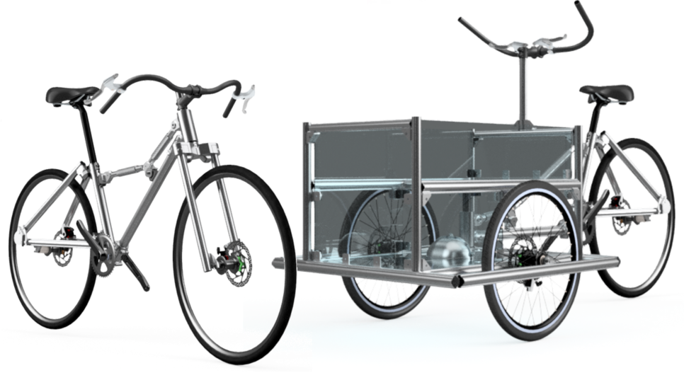
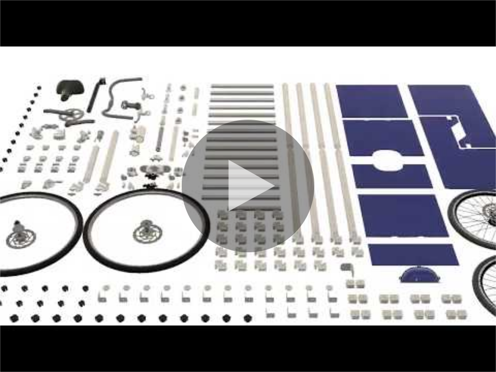
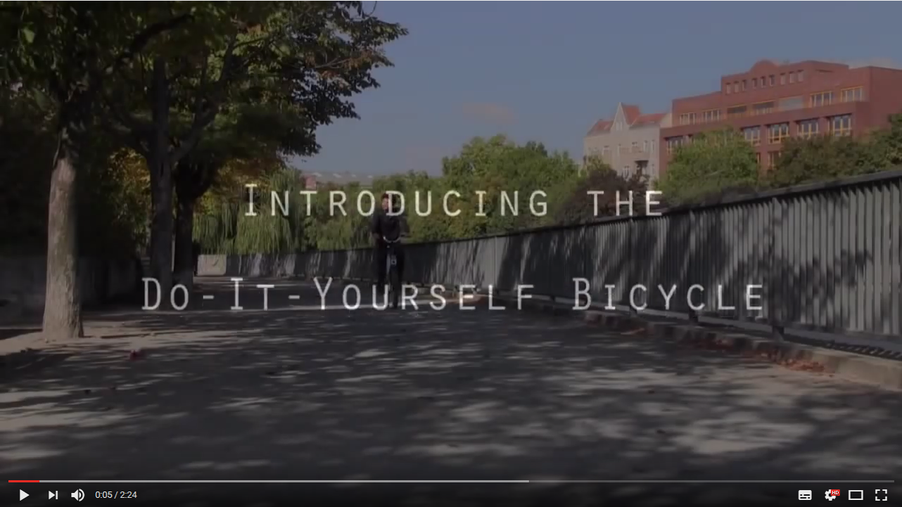

Adjustabike is the concept of an open source build your own bike kit. It is made of standard aluminium tubes and custom attachments you can assemble the way you like. It comes with two predefined frame geometries you can switch from, city and cargo, but the idea is that you can develop any standard or exotic bicycle frame out of it! 

Advantages of the concept:
* **Material efficiency**. All parts are reusable since the assembly does not use any destructive processes. No drills, all joints are made by clamping elements. You can use the same parts to switch from one geometry to another
* **High flexibility**: you can adapt or completely change the geometry whenever you like. Commuting on the morning and going for a ride on the afternoon? Just adapt the geometry from a more comfy to a more sporty one. Doing the groceries yesterday and going on a tete-a-tete trip with your partner tomorrow? Just change from cargo to tandem! 
* **Easy assembly**. All you need to assemble a bicycle frame is a hex key. No complicated tooling, no rigs, just one simple tool.

# Watch the video!

# History

Adjustabike is the last prototype in a row of attempts to design a DIY bicycle, a building kit anyone could assemble at home and reconfigure depending on their daily changing needs. The design rationale of this concept is:
* Instead of fitting one bicycle for each person or use case (commuting, goods transportation, traveling…), one construction set could do all geometries and sizes.
* The construction set fits in a box like IKEA furniture, so it can be easily shipped or transported.
* Unboxing and assembling is quick, easy, and does not require any specific tooling, so it is not reserved for highly skilled people. 
* The assembly and disassembly processes do not involve any destructive process, so that all materials remain reusable, at best for several lifecycles.
* It is easy and quick to switch geometries and measurements, so it really adapts to the deily needs of users.

Look at the video hereafter to learn more about this idea and to see the first prototype ever built:

We think this idea is sustainable in many ways:
* High material productivity: the use of non destructive assembly process alow materials to be used several times
* Qualification and capability building: users learn about bicycles while tweaking their own bike
* Longer service time: by making their own bicycle, users can build a stronger emotional link to their bike as well as capability and willingness to maintain/repair it.
* Reduced transport: the compactness of the kit makes it easier to ship in smaller boxes

# Credits
Contents of this repository are released under an [CC-BY license 4.0](https://creativecommons.org/licenses/by/4.0/) and have been created by Jamie Taylor, under an original idea from Jérémy Bonvoisin. Although we investigated the technical feasibility of this design and know it would work, Adjustabike is still just a concept for now. Feel free to bring it to the next step! We'd love to see lots of them on the streets in the future.